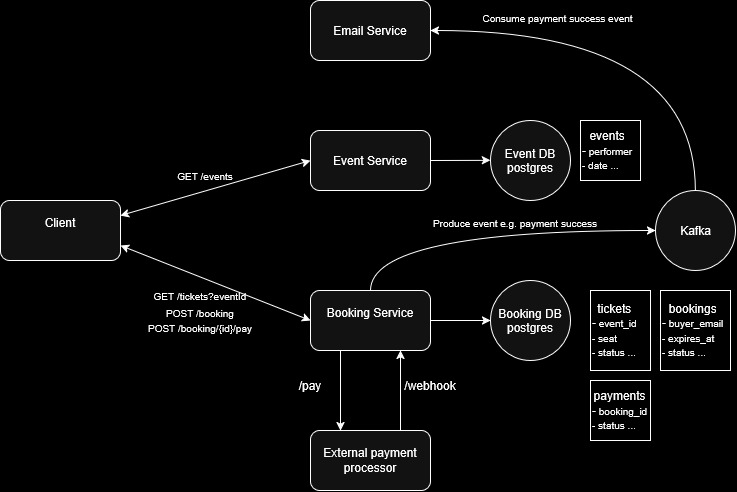

# JTicket - purchase tickets to your favorite events!

## Overview
This is a personal project which simulates an online ticket booking platform. 

The goal of this project is to practice and demonstrate common backend engineering concepts used in modern Java applications, including:

- Spring Boot
- REST APIs
- PostgreSQL
- Database migrations with Flyway
- JPA/Hibernate
- Transactions and concurrency handling
- Kafka-based asynchronous communication
- Integration testing with Testcontainers
- Docker-based local development

## High level design diagram


## Modules

### Event Service

Responsible for retrieving events.

Technologies:

- Spring Boot
- Spring Web MVC
- Spring Data JPA
- PostgreSQL
- Flyway

---

### Booking Service

Responsible for the booking lifecycle.

Responsibilities:

- Creating bookings
- Reserving tickets
- Handling payment flow via 3rd party payment processor (simulated)
- Expiring unfinished reservations
- Ensuring concurrent booking safety

Technologies:

- Spring Boot
- Spring Web MVC
- Spring Data JPA
- PostgreSQL
- Flyway
- Kafka

---

### Email Service

Responsible for asynchronous email processing.

The service consumes Kafka events produced by the Booking Service.

Responsibilities:

- Listening for successful payment events
- Sending booking confirmation emails (simulated)

Technologies:

- Spring Boot
- Kafka

---

### JTicket core

Simple Java library that currently act as a single source of truth for kafka related messaging:

- Topic ids
- Payload definitions

---

## Postgres containers

Currently, there's only one postgres container which creates two databases:

```
CREATE DATABASE jticket_eventdb;
CREATE DATABASE jticket_bookingdb;
```

It's only a matter of config to actually use separate containers for each as the code was written with such intention in mind.

## Requirements

Required:

- Docker
- Docker Compose

Optional for development:

- Java 21+

## Running

Clone the repository:

```bash
git clone https://github.com/tskirbutas/demo-jticket
cd demo-jticket
```

Build the project:
```bash
docker compose build
```

Run:
```bash
docker compose up
```

The default ports:
- event-service:8090
- booking-service:8080

### Maven
To run service from terminal with maven, make sure to install local dependencies (and whenever you update them):
```bash
./mvwn clean install
```
At the moment of writing, there's only one that's needed, namely jticket-core, so instead you can:
```bash
./mvnw clean install -pl jticket-core
```
Then run a service with:
```bash
./mvnw clean spring-boot:run -pl booking-service
```


### Development
During dev, you probably want to run only the infrastructure containers:
```bash
docker compose up postgres kafka kafka-ui
```
Or everything besides the module you are developing, e.g. booking-service:
```bash
docker compose up postgres kafka kafka-ui event-service email-service
```
This is a bit cumbersome. Better dev experience is planned in the future.

### Examples
The event-service and booking-service include a spring dev profile which will seed the DB with some data.

Then to test booking confirmation you could run (assuming booking-service is run with dev profile):
```bash
payment_id=$(
  curl -s -X POST http://localhost:8080/booking/2/pay \
    -H "Content-Type: application/json" \
    -d '{}' |
  grep -oP '"paymentId"\s*:\s*\K-?\d+'
)

curl -v -X POST http://localhost:8080/webhook/fake-payment-processor \
  -H "Content-Type: application/json" \
  -d "{\"paymentId\":$payment_id,\"success\":true}"
```

You should see email-service receiving the event and showing a simulation of sending email:
```
email-service-1  | EmailSenderFake --- Sending email to buyer6@demo.com
email-service-1  | Booking 2 confirmed
email-service-1  | Payment ref: 9053677088059936629
```

More examples is planned in the future.

## Testing

The project uses integration tests to verify the complete application flow.

Tests cover scenarios such as:

- Creating bookings
- Concurrent booking
- Payment confirmation
- Kafka event processing

The convention is to end unit test filenames with *Test and integration ones with *IT.
Run integration tests from your IDE or with maven from project root:
```bash
./mvnw clean verify
```
Or for individual projects:
```bash
./mvnw clean verify -pl booking-service
```
Tests use:

- JUnit
- Spring Boot Test
- Testcontainers

## What's missing / Future improvements

The following features are intentionally not implemented yet:

### API Gateway

Potential improvements:

- Centralized routing
- Authentication and authorization
- Rate limiting
- Request filtering

### Event and ticket admin console 

Currently, it is assumed that an admin will insert those directly via sql

### Search

Elasticsearch-based event search

### Observability

Potential improvements:

- Centralized logging
- Metrics
- Distributed tracing
- Monitoring dashboards

### Deployment

Potential improvements:

- Kubernetes deployment
- CI/CD pipeline
- Cloud deployment
